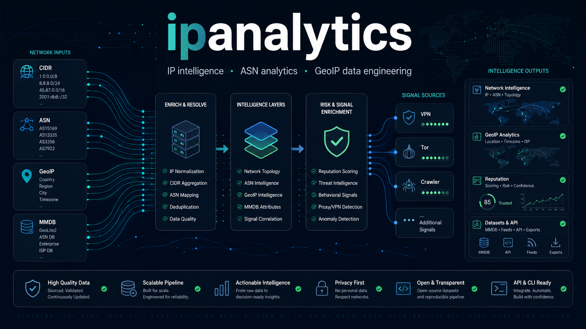

<div align="center">

# IP Analytics - IP Intelligence, VPN Detection, ASN & GeoIP Engineering

<p>
  
</p>

<p>
  <strong>Open-source IP intelligence for VPN infrastructure research, ASN analytics, GeoIP/MMDB engineering, crawler visibility, Tor monitoring, and reputation data pipelines.</strong>
</p>

<p>
  I build datasets, static dashboards, CLI tooling, and enrichment pipelines for teams working with IP reputation, fraud detection, OSINT, threat intelligence, network telemetry, and routing metadata.
</p>

<p>
  <a href="https://github.com/ipanalytics?tab=repositories">
    
  </a>
  <a href="https://github.com/ipanalytics/VPN-Infrastructure-Intelligence-Lab">
    
  </a>
  <a href="https://github.com/ipanalytics/IP-Knowledge-Layer">
    
  </a>
  <a href="https://github.com/ipanalytics/GeoForge">
    
  </a>
</p>

</div>

---

## What I Work On

- IP intelligence and enrichment pipelines with source provenance and confidence scoring
- VPN, proxy, Tor, crawler, cloud, CDN, hosting, and abuse infrastructure analysis
- ASN attribution, hosting dependency mapping, and infrastructure relationship graphs
- GeoIP and MaxMind MMDB tooling for compilation, validation, diffing, and safe updates
- Static dashboards and GitHub-native publishing for open network intelligence datasets
- Operational exports for SIEM enrichment, fraud detection, OSINT, and security analytics

---

## Active Projects

### VPN and Infrastructure Intelligence

| Project | Status | Description |
|---|---:|---|
| [VPN-Infrastructure-Intelligence-Lab](https://github.com/ipanalytics/VPN-Infrastructure-Intelligence-Lab) | Active | Aggregate VPN infrastructure intelligence dataset and interactive dashboard for provider, country, ASN, relationship, archetype, and hosting dependency analysis without publishing raw endpoint data. |
| [ASN-Signal-Graph](https://github.com/ipanalytics/ASN-Signal-Graph) | Active | Public ASN infrastructure signal aggregation for VPN overlap, Tor visibility, public feed exposure, and defensive network analytics. |
| [IP-Knowledge-Layer](https://github.com/ipanalytics/IP-Knowledge-Layer) | Active | Open IP enrichment layer for CIDR, ASN, cloud, CDN, crawler, Tor, and VPN-adjacent network context with source provenance and confidence. |
| [blackroute](https://github.com/ipanalytics/blackroute) | Active | Security intelligence pipeline for aggregating hostile IP infrastructure, abuse feeds, anonymizers, and attack telemetry into runtime lookup databases. |

### Dashboards and Visibility

| Project | Status | Description |
|---|---:|---|
| [CrawlerScope](https://github.com/ipanalytics/CrawlerScope) | Active | Interactive crawler IP intelligence dashboard for search bots, AI crawlers, user-triggered fetchers, monitoring probes, and scanner infrastructure. |
| [Tor-Radar](https://github.com/ipanalytics/Tor-Radar) | Active | Hourly public Tor relay data collection with compact snapshots and a browser-only dashboard, without a database or backend. |

### GeoIP and MMDB Tooling

| Project | Status | Description |
|---|---:|---|
| [GeoForge](https://github.com/ipanalytics/GeoForge) | Active | Local IPv4 GeoIP database compiler combining DB-IP Lite, MaxMind GeoLite2, IP2Location LITE, Sypex Geo, GeoNames, geofeeds, RIR, and WHOIS signals. |
| [MMDBForge](https://github.com/ipanalytics/MMDBForge) | Active | Developer toolkit for inspecting, validating, diffing, and explaining custom MaxMind DB and GeoIP MMDB files. |
| [MMDB-WatchTower](https://github.com/ipanalytics/MMDB-WatchTower) | Active | Production-safe MaxMind DB updater with verification, smoke tests, atomic swaps, rollback, systemd support, and Prometheus metrics. |


---

## Use Cases

- VPN and proxy detection research
- IP reputation enrichment for fraud and abuse systems
- ASN and hosting provider risk analysis
- Tor relay and exit-node visibility
- Crawler, AI bot, scanner, and monitoring probe classification
- GeoIP/MMDB quality checks and reproducible database builds
- SIEM, SOC, OSINT, and threat intelligence enrichment workflows

---

## Infrastructure Model

```text
IP ranges
  -> CIDR normalization
  -> ASN attribution
  -> hosting and cloud classification
  -> VPN / proxy / Tor / crawler signals
  -> GeoIP and MMDB enrichment
  -> reputation and abuse context
  -> dashboards, CSV exports, and local lookup databases
```

---

## Stack

<p align="center">
  
</p>

**Languages:** `Go` `Python` `JavaScript` `HTML`  
**Formats:** `CSV` `JSON` `JSONL` `Parquet` `MMDB` `CIDR`  
**Network metadata:** `ASN` `BGP` `RIR` `WHOIS` `GeoIP` `GeoFeed`  
**Signals:** `VPN` `Proxy` `Tor` `Crawler` `Cloud` `CDN` `Hosting` `IP reputation`

---

## Current Work

- Expanding [VPN-Infrastructure-Intelligence-Lab](https://github.com/ipanalytics/VPN-Infrastructure-Intelligence-Lab) as the main VPN infrastructure research and dashboard project
- Building ASN-level signal aggregation for defensive infrastructure analytics
- Improving crawler, AI bot, Tor, hosting, and public feed visibility
- Developing local-first GeoIP, MMDB, and reputation database tooling
- Publishing compact operational datasets for enrichment pipelines and browser-only dashboards

---

## Design Principles

| Principle | Description |
|---|---|
| Reproducibility | Deterministic dataset generation with auditable inputs. |
| Source transparency | Preserve provenance, confidence, and source context where possible. |
| Defensive focus | Infrastructure intelligence for security, fraud, OSINT, and network analytics workflows. |
| Operational utility | Lightweight exports for SIEM enrichment, local lookups, and repeatable pipelines. |
| Static publishing | Prefer GitHub Pages, static dashboards, and repository-native data releases. |
| Privacy-aware research | Publish aggregate infrastructure intelligence without exposing raw VPN endpoint inventories. |

---

## GitHub Analytics

<p align="center">
  
</p>


---

## Collaboration

Open to collaboration around:

- IP intelligence datasets
- VPN, proxy, Tor, and crawler infrastructure research
- ASN attribution and hosting dependency analysis
- GeoIP and MMDB quality engineering
- IP reputation and abuse-feed enrichment
- SIEM, fraud detection, OSINT, and network analytics integrations

If you work with IP telemetry, routing metadata, fraud systems, abuse detection, or operational network analytics, open an issue or discussion in the relevant repository.

---

## Licensing

Licensing varies by repository depending on source constraints and redistribution requirements.

Common patterns:

- Code: `MIT` or `Apache-2.0`
- Generated datasets: `CC0-1.0`, `CC-BY-4.0`, or repository-specific terms

See each repository license before redistributing derived data.
